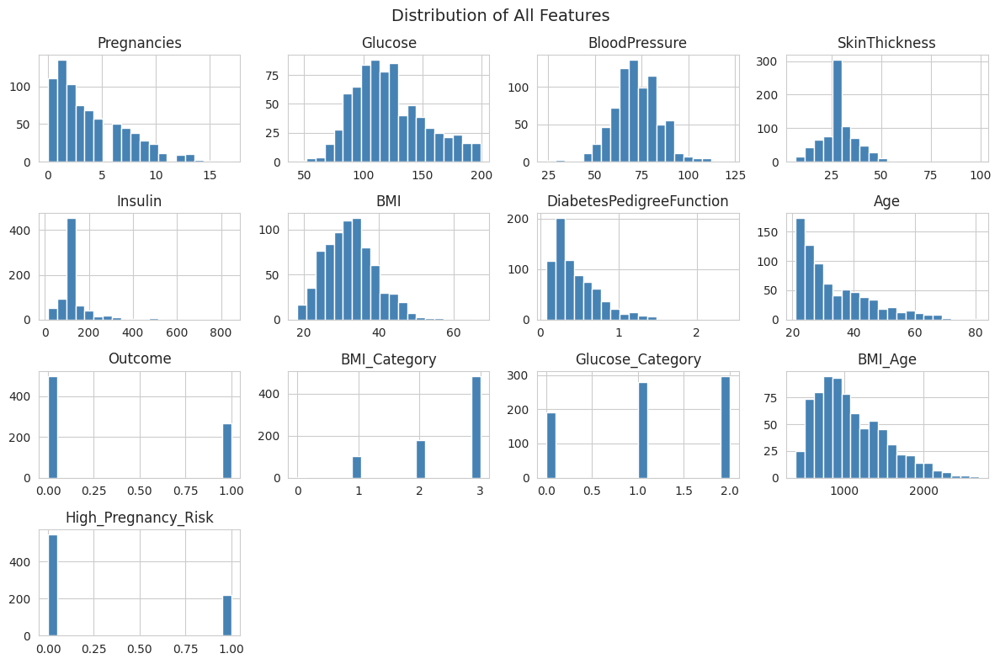
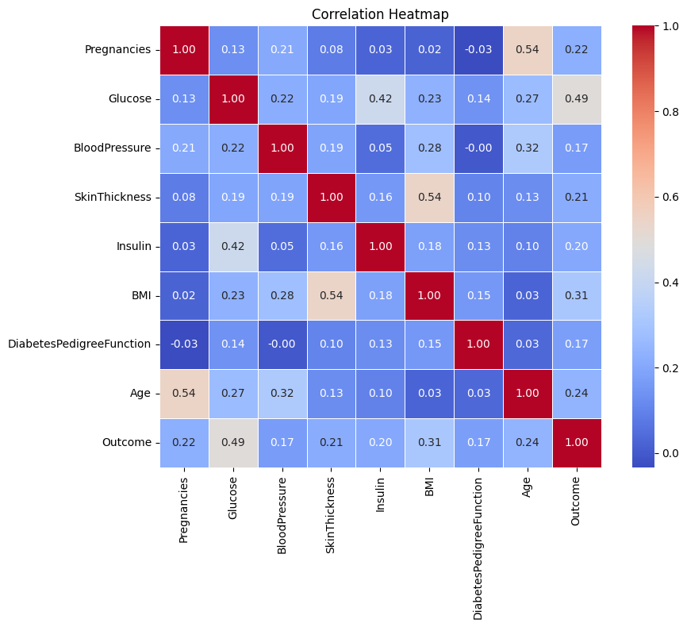
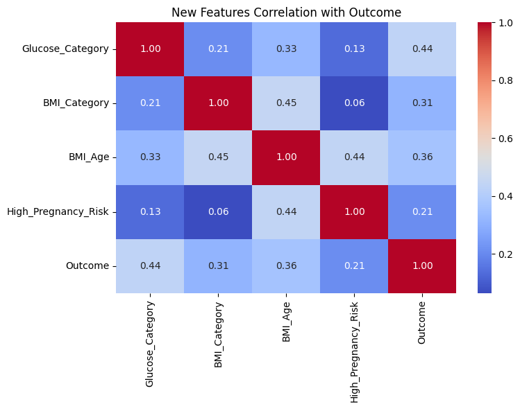
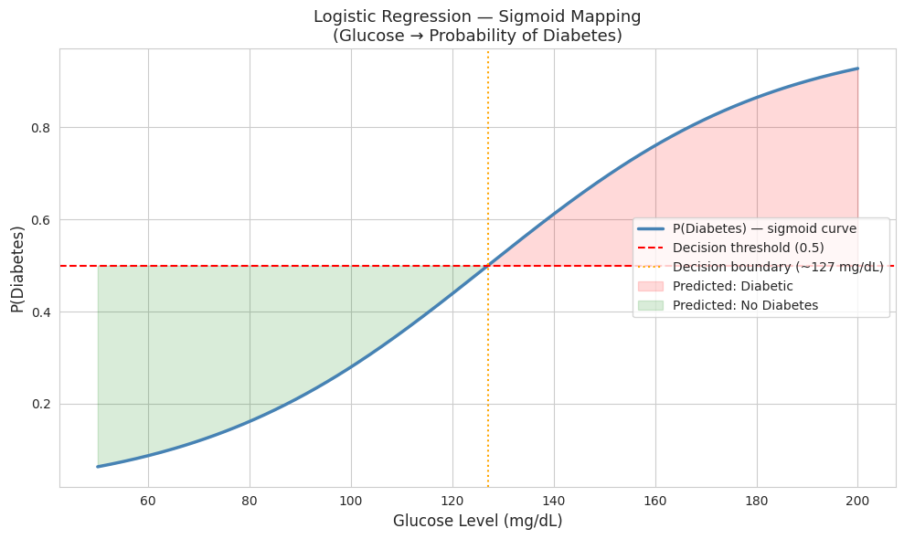
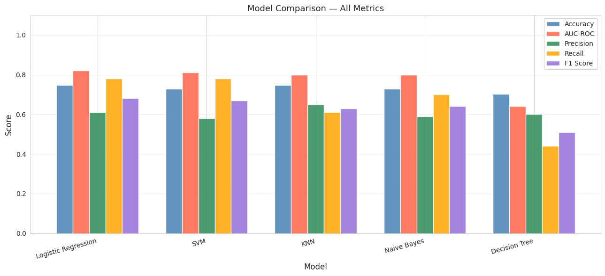

# 🩺 Diabetes Prediction using Machine Learning

> Predicting diabetes in patients using the Pima Indians Diabetes dataset — with full EDA, feature engineering, multi-model comparison, and logistic regression deep dive.

[](YOUR_COLAB_LINK_HERE)


---

## 📌 Problem Statement

Diabetes affects **422 million people worldwide** (WHO, 2023). Early detection is critical — undiagnosed diabetes leads to kidney failure, blindness, and cardiovascular disease. This project builds a machine learning pipeline to predict whether a patient has diabetes based on medical measurements, with a focus on **maximizing Recall** to minimize missed diagnoses (false negatives).

---

## 📂 Dataset

| Property | Details |
|----------|---------|
| Source | [Pima Indians Diabetes Database — Kaggle](https://www.kaggle.com/datasets/uciml/pima-indians-diabetes-database) |
| Origin | National Institute of Diabetes and Digestive and Kidney Diseases (NIDDK) |
| Patients | 768 female patients of Pima Indian heritage |
| Features | 8 medical input features |
| Target | Binary — 0 (No Diabetes), 1 (Diabetes) |
| Class split | 65% No Diabetes / 35% Diabetes |

### Features Description

| Feature | Description | Unit |
|---------|-------------|------|
| `Pregnancies` | Number of times pregnant | Count |
| `Glucose` | Plasma glucose concentration (2hr oral glucose test) | mg/dL |
| `BloodPressure` | Diastolic blood pressure | mm Hg |
| `SkinThickness` | Triceps skinfold thickness | mm |
| `Insulin` | 2-hour serum insulin | mu U/ml |
| `BMI` | Body mass index | kg/m² |
| `DiabetesPedigreeFunction` | Diabetes family history score | Score |
| `Age` | Age of patient | Years |
| `Outcome` | Target — 0 = No Diabetes, 1 = Diabetes | Binary |

---

## 🔍 Exploratory Data Analysis (EDA)

### 1. Hidden Missing Values
A critical insight: **medical values cannot be zero**. A BMI of 0 or Blood Pressure of 0 is physiologically impossible — these zeros are missing values in disguise.

| Column | Zero Count | Action Taken |
|--------|-----------|--------------|
| Glucose | 5 | Replaced with median |
| BloodPressure | 35 | Replaced with median |
| SkinThickness | 227 | Replaced with median |
| Insulin | 374 | Replaced with median |
| BMI | 11 | Replaced with median |

> **Why median and not mean?** Insulin has extreme outliers (up to 846 mu U/ml). Mean would be skewed; median is robust and more clinically realistic.

### 2. Feature Distributions


Key observations:
- `SkinThickness` and `Insulin` are heavily right-skewed
- `Glucose` follows a near-normal distribution around 100–130 mg/dL
- `Age` skews young — most patients are in their 20s–30s

### 3. Class Imbalance
The dataset has a **65% / 35% split** (No Diabetes / Diabetes) — a mild imbalance. Addressed using `class_weight='balanced'` in models.

### 4. Correlation Heatmap


**Top correlations with Outcome (diabetes):**

| Feature | Correlation | Interpretation |
|---------|------------|----------------|
| Glucose | **0.49** | Strongest predictor — aligns with clinical knowledge |
| BMI | **0.31** | Obesity is a major diabetes risk factor |
| Age | 0.24 | Older patients at higher risk |
| Pregnancies | 0.22 | Gestational diabetes link |
| Insulin | 0.20 | Moderate signal |

---

## ⚙️ Feature Engineering

Created **4 new domain-informed features** based on medical thresholds:

```python
# 1. Glucose Category (WHO thresholds)
def glucose_category(g):
    if g < 100:   return 0  # Normal
    elif g < 126: return 1  # Pre-diabetic
    else:         return 2  # Diabetic range

# 2. BMI Category (WHO classification)
def bmi_category(bmi):
    if bmi < 18.5: return 0  # Underweight
    elif bmi < 25: return 1  # Normal
    elif bmi < 30: return 2  # Overweight
    else:          return 3  # Obese

# 3. BMI × Age interaction term
df['BMI_Age'] = df['BMI'] * df['Age']

# 4. High Pregnancy Risk flag
df['High_Pregnancy_Risk'] = (df['Pregnancies'] > 5).astype(int)
```

### New Features Correlation with Outcome


| New Feature | Correlation with Outcome |
|-------------|-------------------------|
| Glucose_Category | **0.44** ✅ |
| BMI_Age | **0.36** ✅ |
| BMI_Category | **0.31** ✅ |
| High_Pregnancy_Risk | 0.21 |

> Dropped `Insulin_Glucose_Ratio` (0.02 correlation — no signal) and `Age_Group` (0.80 overlap with `BMI_Age` — multicollinearity).

---

## 🤖 How Logistic Regression Works

### The Core Idea
Logistic Regression answers: **"What is the probability this patient has diabetes?"**

Unlike Linear Regression (which outputs any number), Logistic Regression uses the **Sigmoid function** to squash any output into a probability between 0 and 1.

### Step 1 — Linear Combination (z)
```
z = w₀ + w₁×Glucose + w₂×BMI + w₃×Age + w₄×Pregnancies + ...
```
Each feature is multiplied by a learned weight. A higher weight = more important feature.

### Step 2 — Sigmoid Function
```
P(Diabetes) = 1 / (1 + e^(-z))
```

| z value | Probability | Meaning |
|---------|------------|---------|
| Very negative (z = -5) | ~1% | Almost certainly no diabetes |
| Zero (z = 0) | 50% | Uncertain |
| Very positive (z = +5) | ~99% | Almost certainly diabetes |

### Step 3 — Decision Threshold
```
P(Diabetes) >= 0.5  →  Predict: Diabetes (1)
P(Diabetes) <  0.5  →  Predict: No Diabetes (0)
```

### Sigmoid Curve


### Decision Boundary on Real Data


> **Why not just use Linear Regression?**
> Linear Regression can output values like -3 or 1.8 — meaningless as probabilities. Sigmoid constrains the output to [0, 1], making it interpretable as a probability.

### Why Recall Matters More Than Accuracy Here
In medical diagnosis, two types of errors have very different consequences:

| Error | What happens | Severity |
|-------|-------------|----------|
| False Positive (says diabetic, they're not) | Patient gets extra tests | Annoying |
| False Negative (says healthy, they ARE diabetic) | Patient goes untreated | **Dangerous** |

This is why we use `class_weight='balanced'` — it tells the model to penalize missed diabetics more heavily.

---

## 🏋️ Model Training

### Preprocessing Pipeline
```python
# 1. Replace invalid zeros with median
for col in ['Glucose','BloodPressure','SkinThickness','Insulin','BMI']:
    df[col] = df[col].replace(0, np.nan).fillna(df[col].median())

# 2. Train-test split (80/20, stratified)
X_train, X_test, y_train, y_test = train_test_split(
    X, y, test_size=0.2, random_state=42, stratify=y
)

# 3. Feature scaling
scaler = StandardScaler()
X_train = scaler.fit_transform(X_train)
X_test  = scaler.transform(X_test)
```

---

## 📊 Model Comparison — All 5 Models

### Confusion Matrices


### Performance Summary

| Model | Accuracy | AUC-ROC | Precision | Recall | F1 Score |
|-------|----------|---------|-----------|--------|----------|
| 🥇 Logistic Regression | **74.68%** | **0.82** | 0.61 | **0.78** | **0.68** |
| 🥈 KNN | 74.68% | 0.80 | **0.65** | 0.61 | 0.63 |
| 🥉 SVM | 72.73% | 0.81 | 0.58 | **0.78** | 0.67 |
| Naive Bayes | 72.73% | 0.80 | 0.59 | 0.70 | 0.64 |
| Decision Tree | 70.13% | 0.64 | 0.60 | 0.44 | 0.51 |

> Fill in your results after running the model comparison code.

### Model Comparison Chart


### Why Logistic Regression Wins for This Problem

| Criteria | LR | KNN | Naive Bayes | Decision Tree | SVM |
|----------|----|-----|------------|---------------|-----|
| Interpretable | ✅ | ❌ | ✅ | ✅ | ❌ |
| Fast to train | ✅ | ✅ | ✅ | ✅ | ✅ |
| Handles imbalance | ✅ | ❌ | ❌ | ✅ | ✅ |
| Outputs probability | ✅ | ❌ | ✅ | ❌ | ❌ |
| Good AUC-ROC | ✅ | — | — | — | — |

---

## 📈 Final Results — Best Model (Logistic Regression)

```
Accuracy  : 74.68%
AUC-ROC   : 0.82
Precision : 0.61   (of predicted diabetics, 61% actually are)
Recall    : 0.78   (of actual diabetics, 78% are caught)
F1 Score  : 0.68

Confusion Matrix:
              Predicted No    Predicted Yes
Actual No  →     73               27
Actual Yes →     12               42
```

### ROC Curve

> AUC of 0.82 means the model correctly ranks a randomly selected diabetic patient above a healthy one **82% of the time**.

---

## 🚀 Key Improvements Made

1. **Replaced hidden zero values** with column medians — clinically justified preprocessing
2. **Engineered 4 new features** from medical domain knowledge (WHO glucose/BMI thresholds)
3. **Applied `class_weight='balanced'`** — improved diabetic Recall from **50% → 78%**
4. **Compared 5 models** — selected best based on AUC-ROC, not just accuracy

---

## 🛠️ Tech Stack

```
Language   : Python 3.10
Libraries  : Pandas, NumPy, Scikit-learn, Seaborn, Matplotlib
Environment: Google Colab
Dataset    : Pima Indians Diabetes — Kaggle / UCI ML Repository
```

---

## ▶️ How to Run

```bash
# Clone the repo
git clone https://github.com/YOUR_USERNAME/diabetes-prediction.git
cd diabetes-prediction

# Install dependencies
pip install pandas numpy scikit-learn seaborn matplotlib

# Run the notebook
jupyter notebook notebooks/diabetes_prediction.ipynb
```

Or open directly in Google Colab using the badge at the top.

---

## 📁 Project Structure

```
diabetes-prediction/
├── data/
│   └── diabetes.csv
├── notebooks/
│   └── diabetes_prediction.ipynb
├── images/
│   ├── distribution.png
│   ├── correlation_heatmap.png
│   ├── new_features_heatmap.png
│   ├── sigmoid_curve.png
│   ├── decision_boundary.png
│   ├── all_confusion_matrices.png
│   ├── model_comparison.png
│   └── roc_curve.png
└── README.md
```

---

## 👤 Author

**Muchkund** — B.Tech AI & Data Science, YCCE Nagpur  
[](https://github.com/YOUR_USERNAME)

---

## 📄 License

This project is open source under the [MIT License](LICENSE).